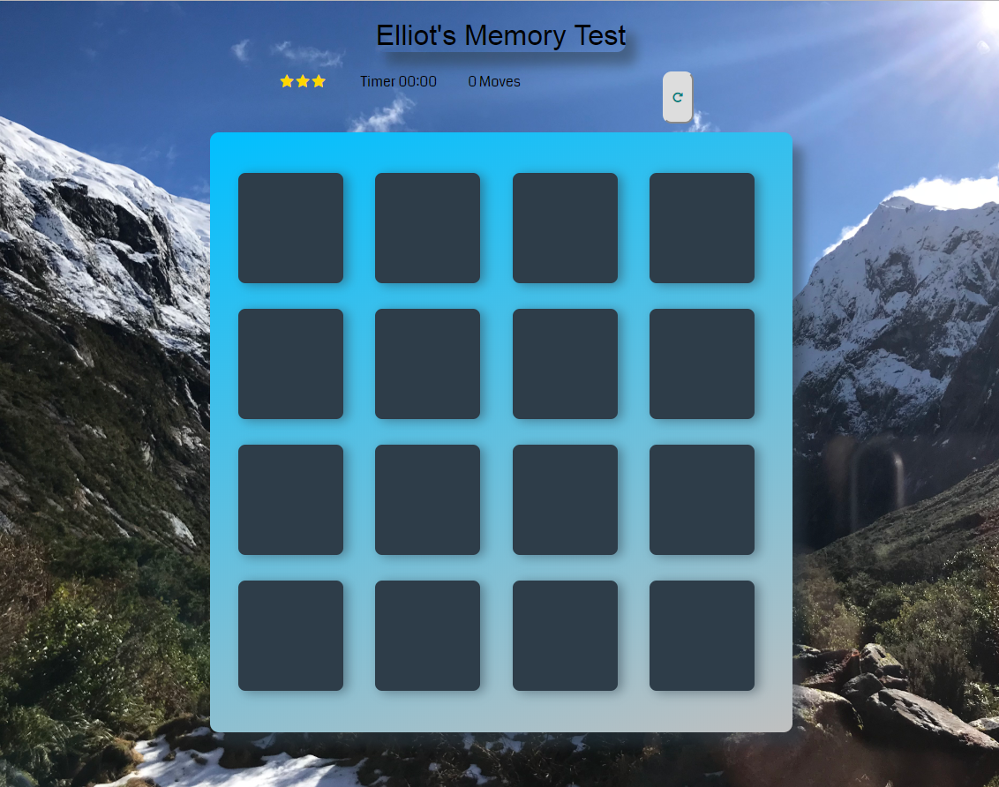

# Project Overview

In this project I was given some starting code that formed the foundation of the memory game. I used this starting code and implemented Javscript to complete it. a number of important components were learnt in this project such as functions, objects, variables and more.
How the Game Works
The game board consists of sixteen "cards" arranged in a grid. The deck is made up of eight different pairs of cards, each with different symbols on one side. The cards are arranged randomly on the grid with the symbol face down. The gameplay rules are very simple: flip over two hidden cards at a time to locate the ones that match!

Each turn:

The player flips one card over to reveal its underlying symbol.
The player then turns over a second card, trying to find the corresponding card with the same symbol.
If the cards match, both cards stay flipped over.
If the cards do not match, both cards are flipped face down.
The game ends once all cards have been correctly matched.

Game Functionality

## Why this Project?

This project helped me to develop my Javascript skills for the first time in a tough environment. Use of the DOM was a huge component, as well as event listeners which would come in handy for projects to come. There was 5 important components to the memory game.

1.  Start by building a grid of cards.

2. Add the functionality to handle clicks.

3. Work on the matching logic.

4. Create the winning condition.

5. Implement additional functionality , such as the move counter, timer, star rating, and reset button.

# Running the Application

1. Download the repo off github.

2. The application's opening /viewing point is at mg.html. Download this file, it will then need to be opened within a browser.
